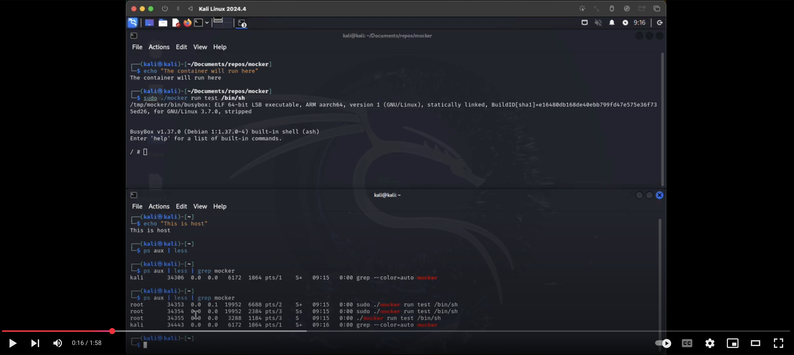

# _mocker_: a minimal container runtime in C


This project implements a basic container runtime in C that demonstrates core container concepts like process isolation, networking and filesystem isolation, and mount namespaces.

[](https://www.youtube.com/watch?v=MNBXOb73fxs 'mocker demo')

## Featuress

- **Process Isolation**: Makes use of Linux namespaces (PID, Mount, UTS, IPC) to isolate processes using [clone](https://man7.org/linux/man-pages/man2/clone.2.html) and the appropriate flags when creating the child process.
- **Filesystem Isolation**: Creates an isolated filesystem environment by creating necessary directories, copying the [BusyBox](https://www.busybox.net/downloads/BusyBox.html) binary, and mapping symlinks to busybox utilities. It then uses [chroot](https://man7.org/linux/man-pages/man2/chroot.2.html) change the root filesystem, ensuring the child process operates within its own filesystem.
- **Mount Namespace**: Configures essential filesystem mounts, including `proc`, `sys`, and `tmpfs`, within the container's root filesystem. This is done using the [mount](https://man7.org/linux/man-pages/man2/mount.2.html) system call to ensure the container has access to necessary system information and temporary storage.
- **Minimal Root Filesystem**: Uses busyBox to provide a minimal set of Unix utilities within the container. This involves copying the BusyBox binary to the container's `bin` directory and creating symbolic links for various utilities.
- **Networking**: Includes Network namespace isolation using the `clone()` system call, virtual ethernet (veth) pair creation for container-host communication, IP address configuration for both container and host interfaces, NAT setup using iptables for internet connectivity, and DNS resolution through host DNS configuration (thank you Ivan Velichko of [iximiuz labs](https://labs.iximiuz.com/tutorials/container-networking-from-scratch)!)
- **Cleanup**: Ensures proper unmounting of filesystems, networking, and cleanup of resources to maintain system integrity using [umount2](https://man7.org/linux/man-pages/man2/umount.2.html). This involves unmounting the `proc`, `sys`, and `tmpfs` filesystems, removing any temporary directories created during the setup, and deletion of the virtual ethernet interfaces.

## A note on networking:

I am in the process of replacing the networking setup from the use of linux utilities + `system()` to [netlink sockets in linux](https://man7.org/linux/man-pages/man7/netlink.7.html) using [libmnl](https://www.netfilter.org/projects/libmnl/doxygen/html/). The roadmap is as follows:

1. Creating veth pairs :white_check_mark:
2. Moving interfaces to namespaces :white_check_mark:
3. Setting host interface state up :white_check_mark:
4. Setting continaer interface state up :hourglass_flowing_sand:
5. Configuring IP addresses
6. Setting up routing

## Requirements

- Linux system with namespace support
- GCC compiler
- busybox-static package
- Root privileges (for namespace operations)
- (optional) Docker

## Building

```shell
# Install required packages (on Debian/Ubuntu)
sudo apt-get update
sudo apt-get install -y build-essential gcc make libmnl-dev busybox-static

# Use make to compile/buld
make

# use make to run (will open shell in container)
make run
```

## Usage

![alt-text][1]

You can run `mocker` inside a VM running Linux (tested with Kali) and execute a limited set of commands inside the _mocker_ container.

The container runtime accepts commands in this format:

```shell
sudo ./mocker run <image-name> <command> [args...]
```

Note: The `image-name` argument is currently a placeholder as image handling is not implemented.

Examples:

```shell
# List files in container
sudo ./mocker run ubuntu:latest /bin/ls /

# Run a shell in container
sudo ./mocker run ubuntu:latest /bin/sh

# Echo a message
sudo ./mocker run ubuntu:latest /bin/echo "Hello from container"

# Check processes
sudo ./mocker run ubuntu:latest /bin/ps

# Test networking
sudo ./mocker run ubuntu:latest /bin/sh
ip link ls                  # should show lo and ceth0
ping -c 3 google.com        # should ping google (proves internet connectivity and DNS config)
ip route show               # should show default route
# and from the host machine (in another terminal)
sudo iptables -t nat -L POSTROUTING -n # should show MASQUERADE rule
# exit container and verify cleanup
ip link ls | grep veth0     # should show nothing (successfully cleaned up when container stops)
```

## Current Limitations

- No image handling (uses local busybox only)
- No resource limits (cgroups not implemented)
- No user namespace isolation
- Minimal command set through busybox
- No persistent storage

## Future Improvements

Possible enhancements:

- Container image support
- Use cgroups for resource control
- User namespace support
- Support for persistent volumes

## Security Notes

This is a educational implementation and lacks many security features of production container runtimes. Do not use on your host machine directly! Use a virtual machine!

## License

This project is provided as-is for educational purposes.

[1]: public/mocker-demo.gif 'Demo of mocker container running'
